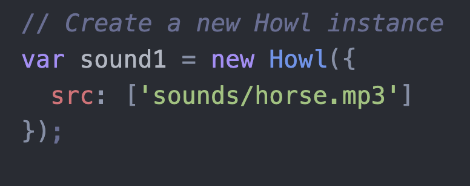
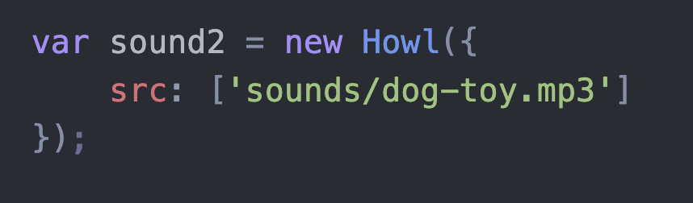

# Entry 3
##### 11/20/23

## content:
* I am cotinuing my research with howler.js
## sources:
* https://codepen.io/n3pu/pen/oNNZPdp
* https://dyclassroom.com/reference-javascript/work-with-audio-in-javascript-using-howler-js
* https://unpkg.com/browse/howler@1.1.22/README.md
* https://www.crowdbotics.com/blog/build-your-own-radio-streaming-app-with-howler-js
* https://goldfirestudios.com/howler-js-modern-web-audio-javascript-library
## EDP {Engineering design process}
* I am still in the brainstorming part of the process

## Issues:
* live server extension and http-server isn't working, I cannot tinker further[]
## discoveries!
* in order to create multiple buttons that play sound when clicked, you have to create new **Keyword** names for each
* usage of arrays is needed to facilitate te usage of multiple sounds, as having individual buttons for my project is time consuming, and harder to manipulate

## Fp Goal for Mid-Winter Break:

set up the html/css for my freedom project, all of the fonts, colors, backgrounds, buttons/divs, so that when I come back, I am able to just work on the howler.js aspect of the website, to create my freedom project, which will be a interactive beat kit.

[Previous](entry02.md) | [Next](entry04.md)

[Home](../README.md)
