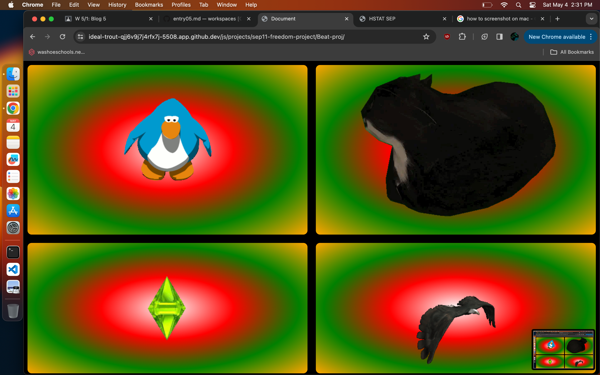

# Entry 5
##### 5/1/2024

# content:
done with mvp!

## EDP (Engineering design Process):
I am done with the mvp (minimal viable project).

sources:
## sources:
* https://codepen.io/n3pu/pen/oNNZPdp
* https://dyclassroom.com/reference-javascript/work-with-audio-in-javascript-using-howler-js
* https://unpkg.com/browse/howler@1.1.22/README.md
* https://www.crowdbotics.com/blog/build-your-own-radio-streaming-app-with-howler-js
* https://goldfirestudios.com/howler-js-modern-web-audio-javascript-library
* https://moviemaker.minitool.com/moviemaker/free-sound-effects.html
* https://www.freesoundeffects.com/free-sounds/drum-loops-10031/

**my preview**

## skills:
Growth-mindset:
* I have been done for a while, So I have been forced to stick with my project and think of what's wrong with it.

Debugging
* There have been a lot of bugs with the sounds playing and event listeners, so I have to mess wround with the code, ultimately discovering each new sound needs a different keyword.

## future plans:
* I have already done some of them, like adding DOM features like colors changing on click.
* I will wait until we get to show our project to others in class to get feedback on anything I can potentially add or change.

[Previous](entry04.md) | [Next](entry06.md)

[Home](../README.md)
